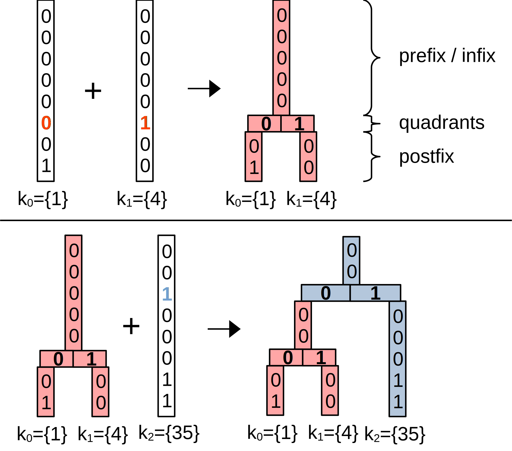
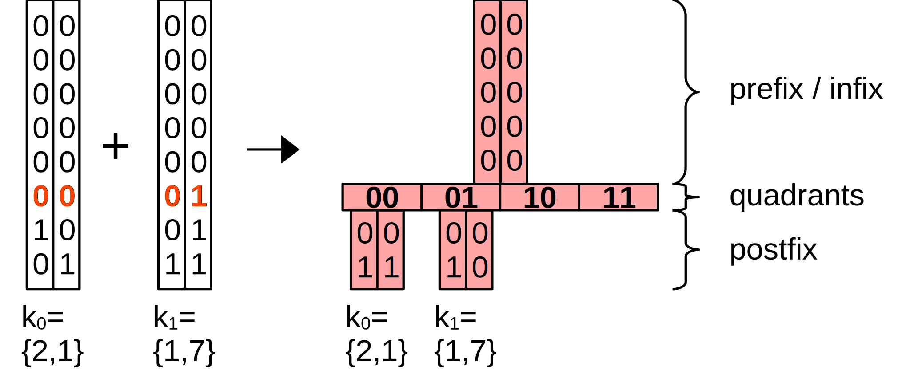

---
# Feel free to add content and custom Front Matter to this file.
# To modify the layout, see https://jekyllrb.com/docs/themes/#overriding-theme-defaults

layout: home

# layout: single
# classes: wide
# toc: true
# #toc_label: "My Table of Contents"
# toc_icon: "cog"
# toc_sticky: true

#author_profile: true
---


<!-- Kramdown TOC -->
* TOC
{:toc}

# The PH-tree

The PH-tree is a [spatial index](https://en.wikipedia.org/wiki/Spatial_database#Spatial_index) / multi-dimensional index. It is similar in function to other spatial indexes such as [quadtree](https://en.wikipedia.org/wiki/Quadtree), [kd-tree](https://en.wikipedia.org/wiki/K-d_tree) or [R-tree](https://en.wikipedia.org/wiki/R-tree).

It supports the usual operations such as insert/remove, window queries and nearest neighbor queries. It can store points or axis-aligned boxes.

Compared to other spatial indexes the PH-tree's strengths are:

- Fast insert and remove operations. There is also no rebalancing, so insertion and removal times are quite predictable.
- Good scalability with dataset size. It is usually slower than other indexes when working on small datasets with 100 or 1000 entries, but it scales very well with large datasets and has been tested with 100M entries.
- Good scalability with dimension. It works best between 3 and 10-20 dimensions. The Java versions has been tested with 1000 dimensions where nearest neighbor queries were about as fast as with an R-Tree and faster than a kd-tree.
- It deals well with most types of datasets, e.g. it works fine with strongly clustered data. 
- Window queries are comparatively fast if they return a small result set, e.g. up to 10-50 entries. For larger result sets, other indexes are typically better.
- The PH-Tree is an *ordered* tree, i.e. when traversing the data, e.g. the results of a query, the data is [Morton-ordered (z-order curve)](https://en.wikipedia.org/wiki/Z-order_curve).

Here are [results from performance tests](https://github.com/tzaeschke/TinSpin/blob/master/doc/benchmark-2017-01/Diagrams.pdf) with the [TinSpin](https://tinspin.org) framework on the PH-tree Java implementation.

# Implementations

PH-tree implementations that I am aware of:

 - **C++**: [here](https://github.com/tzaeschke/phtree-cpp) (my fork of Improbable's implementation), by [Improbable](https://github.com/improbable-eng/phtree-cpp) and by [mcxme](https://github.com/mcxme/phtree)
 - **Java**: [here](https://github.com/tzaeschke/phtree)

Other spatial indexes (Java) can be found in the [TinSpin index library](https://github.com/tzaeschke/tinspin-indexes).

There is also the [TinSpin](https://tinspin.org) spatial index testing framework.

## Support
Please contact me on [Discord](https://discord.gg/GNYjyyYq) or create GitHub Issues.

## Documents

- The PH-tree was developed at ETH Zurich and first published in
[The PH-Tree: A Space-Efficient Storage Structure and Multi-Dimensional Index](https://github.com/tzaeschke/phtree/blob/master/PH-Tree-v1.1-2014-06-28.pdf), 
Tilmann Zäschke, Christoph Zimmerli and Moira C. Norrie, 
Proceedings of Intl. Conf. on Management of Data (SIGMOD), 2014
- The current version of the PH-tree is discussed in more detail in this [The PH-Tree Revisited](https://github.com/tzaeschke/phtree/blob/master/PhTreeRevisited.pdf) (2015).
- There is a Master thesis about [Cluster-Computing and Parallelization for the Multi-Dimensional PH-Index](http://e-collection.library.ethz.ch/eserv/eth:47729/eth-47729-01.pdf) (2015).
- The hypercube navigation is discussed in detail in [Efficient Z-Ordered Traversal of Hypercube Indexes](https://github.com/tzaeschke/phtree/blob/master/Z-Ordered_Hypercube_Navigation.pdf) (2017).

# How does it work?

The PH-tree is explained in several parts. First we discuss the structure of the tree, i.e. how the data is organized. Next we discuss navigation in the tree, i.e. how we can efficiently find data or find places to insert new data.

## PH-tree vs Quadtree

The PH-tree is similar to a quadtree in the sense that:
* It uses a hierarchy of nodes to organize data
* Each node is a square and has four quadrants (eight in 3D, in general 2dim quadrants), i.e. each node splits space in all dimensions.
* Nodes are split into sub-nodes when they contain too many points.

However, the PH-tree does some things differently in order to:
* improve scalability with higher dimensions than 2D or 3D,
* avoid “deep” trees when storing strongly clustered data,
* avoid nodes with < 2 entries (except the root node), and
* reduce reshuffling of data when nodes are split/merged.

Differences in appearance to quadtrees
* The PH-tree works with integers (it works fine with floating point numbers as well, as we discuss later)
* The PH-tree’s “highest”possible node always has $(0,0)$ as center and an endge length $l_{max} = 2^{32}$ (for 32 bit coordinates).
* This node may not exist in most trees, but all nodes are aligned as if it existed, e.g. no other node overlaps with $(0,0)$.
* In a PH-tree, child nodes always have an edge length 
$l_{child} = l_{parent} / 2^y$, with $y$ being a positive integer such that $l_{child}$ is always an $integer >= 1$, in fact $l_{child}$ is always a power of $2$. 
* This limits the depth of a PH-tree to 32.
* Quadrant capacity = 1, i.e. a quadrant can hold at most one entry, either a sub-node entry or a point/data entry.

# Structure

## 1D PH-tree

Let's start with a very simple example, a 1-dimensional PH-tree that stores 1-dimensional points, AKA simple numbers.

The picture below shows an example of a 1-dimensional PH-tree with 8-bit coordinates (basically a tree of sorted integers).
First we add (1) and (4) to an empty tree, resulting in a tree with a single node. Then we add (35), resulting in a tree with a root node and one child node.

Add (1) and (4)             |  Add (35)
:-------------------------:|:-------------------------:
{:width="90%"} | {:width="90%"}

Summary:
* The 1D PH-Tree is equivalent to a [CritBit](https://cr.yp.to/critbit.html) [tree](https://en.wikipedia.org/wiki/Radix_tree) or [digital PATRICIA trie](https://de.wikipedia.org/wiki/Patricia-Trie).
* The tree uses the natural ordering of keys.
* The shape of the tree is independent of insertion order.
* Limited depth & imbalance: Maximum depth is the number of bits of a value, usually 32 or 64. Limited depth means limited imbalance.
* No rebalancing.

## Some terminology

A a stored **point** is also called **key** or  **coordinate**.
A PH-tree is essentially a [map](https://en.wikipedia.org/wiki/Associative_array), so every key is associated with a **value**, forming key/value pairs.

A node has (up to) $2^d$ **quadrants**, every quadrant contains $0$ or $1$ **entries**. Every entry is either a key/value pair or a key/subnode pair (subnode = child node).

From the viewpoint of a node, every point (=key) is divided into the following sections:

* **Infix**: all bits above the current node.
* **Prefix**: all bits between the current node and it’s parent.
* **Critical** bit(s): the bit(s) that represent the HC address of the point/key.
* **Postfix**: all bits below the current node (usually only if there is no child node, otherwise called “infix of child”).

Infix, prefix, postfix, ... |
:-------------------------:|
{:width="60%"} |

Commonly used variables:
* ***d*** is the number of dimensions.
* ***w*** is the current depth of the tree, i.e. the length of the prefix. Usually we have $0 \leq w \lt 32$ or $0 \leq w \lt 64$. 

## 2D PH-tree

The next example (left) demonstrates how keys with multiple dimensions are stored in the tree. Note how the two relevant bits from each key represent the position in the node's array of entries/quadrants. That means in order to find the correct quadrant in a node *we only need to extract two bits from a key* to locate the relevant quadrant/entry.

The example on the right shows a tree with two nodes. In order to insert (6,5) we only need to extract 2x2 bits and jump to the corresponding array slot.

A tree with two 2D-keys: (2,1) and (1.7)| A tree with two nodes
:-------------------------:|:-------------------------:
{:width="100%"}|{:width="100%"}

In the 1D example, the node's array was labeled "critical bit", in the 2D case it is labelled "hypercube". This means that the array forms a $d$-dimensional hypercube, see next section.

<!-- {:width="50%"} -->
<!-- {:width="50%"} -->

<!-- 
There are three possible scenarios when inserting an entry:
* a) Insertion where the infix/prefix of a node does not match: this results in insertion of a new node above the node with the infix. This is also called prefix collision or infix collision.
* b) Insertion in an existing node.
* c) INsertion with postfix collision. This result in insertion of a new node below the current node.

Infix, prefix, postfix, ... |
:-------------------------:|
{:width="50%"}
 -->

## Hypercube addressing

The nodes in a PH-tree all form $d$-dimensional binary [hypercubes](https://en.wikipedia.org/wiki/Hypercube) (binary Hamming Space). "Binary" here means that in each dimension there are only two possible values: $0$ and $1$.

This means, in order to address all quadrants in a node we need exactly **one bit for every dimension**.

Such an address is called Hypercube address or **HC address**. A HC address is simply a number with $d$ bits: e.g. 011… 

The idea here is that this allows **processing of HC addresses with up to 64 dimensions in constant time** (assuming 64 bit CPU registers)**!**

<!-- {:width="50%"} -->

HC addresses for 1D, 2D and 3D|
:-------------------------:|
{:width="70%"} |

Note that the ordering of corners results in something called **[Morton-order](https://en.wikipedia.org/wiki/Z-order_curve)** and forms a **[Z-order curve](https://en.wikipedia.org/wiki/Z-order_curve)** when quadrants are traversed in the natural order of their HC addresses.

## Large nodes: AHC, LHC and BHC

With increasing dimensionality $d$, node quickly become unwieldy due to having up to $2^d$ quadrants. Therefore, PH-tree implementations usually use
arrays (array hypercube, or AHC) only for low dimensoinality, e.g. up to 3 or 4 dimensions. For $4 \leq d \leq 8$ implementations may use a list (LHC representation).
For $d \gt 8$ many use trees, e.g. B+trees (BHC represenation).

A 3D node in AHC (left) and LHC representation (right)|
:-------------------------:|
{:width="80%"}|

In the example above, the AHC implementations uses 1 bit per slot to signify occupany of a slot/quadrant. 

# Queries

## Point queries

HC addresses for 1D, 2D and 3D|
:-------------------------:|
{:width="50%"}|

## Window queries

HC addresses for 1D, 2D and 3D|
:-------------------------:|
{:width="70%"}|

HC addresses for 1D, 2D and 3D|
:-------------------------:|:-------------------------:
{:width="70%"}|{:width="70%"}|

# Performance

<!-- 
# OLD
## Structure

This explanation requires the reader to have a solid understanding of how [quadtrees](https://en.wikipedia.org/wiki/Quadtree)/[octrees](https://en.wikipedia.org/wiki/Octree) work (so please understand these first if you haven't already).
For the remainder of the discussion let's assume that we store 32 bit coordinates, however storing 64 bit or other bit widths is straight forward.
Let's also assume that we use store 2D point data, however other dimensions (up to 60 or even 1000) and rectangle data is also possible.

The PH-tree is similar to a quadtree in that it uses a hierarchy of nodes to order objects in space. Each node consists of four quadrants (or eight octants in 3D or more in higher dimensionality), i.e. each node splits the space in all dimensions.

The first difference to quadtrees is that a PH-tree stores only **integer coordinates**. Floating point coordinates can only be stored indirectly (a method for lossless conversion from floating point -> integer -> floating point is discussed below).

The second difference is that the **root node** is always fixed with a **center point at (0,0)** and an **edge length of $2^{32}$**. That means that the root node represent a square that encompasses all possible 32 bit coorindates coordinates.

Another difference is that in a PH-Tree, a child node does not have to be the same size as a quadrant of it's parent node. Instead, a child's size can be any fraction of the form $\text{child_length} = \text{parent_length}/(2^x)$ as long as $\text{child_length} >= 1$ and with $x$ being an integer $>=1$). For example, if all your data is between (0,0) and (1000, 1000), then the root node has exactly one child node with the center at (512,512) and edge $\text{length} = 1024$. All data is stored in this child and it's children (and sub-children, etc).

Like a quadtree, the PH-tree subdivides each node into quadrants of equals size, thus recusively dividing space. Using integer coordinates and a fixed size root node means that all quadrants have an edge length that is a power of two. The maximum depth of the tree is 32 (the root not has an edge length of $2^{32}$, so at depth 32 we get $\text{edge_length} = 2^{32}/2^{32} = 1$. Also, together with the root's center being (0,0), this means that all node's center points and corner points are integer coordinates. This brings some advantages:

 * There is no room for problems caused by mathematical imprecision when dividing floating point coordinate repeatedly by $2.0$.
 * Integer division by two is faster that floating point division. In fact, the edge length can be calculated using a right-bit-shift instead of division.
 * The maximum depth is 32. This is inherently limits degeneration in case of strongly clustered data.

Yet another difference is that every node in a PH-Tree has at least two entries but most one entry per quadrant (the exception is the root node which may have less than two children). Since a node has $2^{dimension}$ quadrants, every node can have up to $2^{dimension}$ entries. **For high dimensionality, nodes can get very large, but this is _not_ a problem!**

The next difference is that the PH-tree is essentially a *map* (whereas the quadtree is a multi-map) in the sense that for every coordinate, there can be only one entry. In order to act as a multi-map that can store multiple entries per coordinate, the PH-tree can store a *set* or *list* of entries for each coordinate. 

One consequence of this is that modifications to the tree (insert/remove) will only ever require one node to be modified + potienially another node added or removed. There is no need (or possibility) for rebalancing. The trees shape is determined exclusively by the data, not by insertion order or other parameters.

## Navigation

### Quadrant numbering

The PH-tree uses the bits of the multi-dimensional keys to determine their position in the tree. All keys that have the same leading bits are stored in the same branch of the tree.

For example, in a node at level L, to determine the quadrant where a key should be inserted (or removed or looked up), it looks at the L's bit of each dimension of the key. For a 3D node with 8 quadrants (forming a cube) the L's bit of the first dimension of the key determines whether the target quadrant is on the left or the right of the cube, the L's bit of the second dimension determines whether it is at the front or the back, and the L's bit of the third dimension determines bottom vs top, see picture.
Example of a PH-tree with three keys added, resulting in two nodes. A root node (red) and a subnode (blue).

### 1D example

<!-- Mathjax quirks:  
     - using _ after a letter works fine, but after } it requires a \  (also after a number?)
     - Around numbers (?), curly braces require \\{ instead of \{ 
   -->

<!--
Example with three 1D keys with 8bit values:

$ k_0 = \\{1\\}\_{base\ 10} = \\{00000001\\}\_{base\ 2} $, 

$ k_1 = \\{1\\}\_{10} = \\{00000100\\}\_{2} $ and 

$ k_2 = \\{35\\}\_{10} = \\{00100011\\}\_2 $. 

Adding $k_{0}$ and $k_{1}$ to an empty tree results in a single node. The two keys first differ in their 6th bit so the node has a level $L=5$ (starting with $0$). The node has a 5bit prefix representing the common 5 bits of both keys. The node has two quadrants, each key is stored in one quadrant. Adding a third key $k_{3}$ results in one additional node at $L = 2$ with one quadrant containing the original node as subnode and the other quadrant containing the new key $k_{2}$.

### 2D example

With 2D keys every node has $2^{d}=4$ quadrants. The position of the quadrant where a key is stored is extracted from the respective bits of the keys, one bit from each dimension. The four quadrants of the node form a 2D hypercube (quadrants may be empty). The bits that are extracted from the keys form the hypercube address $h$, for $k_{0}\rightarrow h=\\{00\\}\_{2}$ and for $k_{1}\rightarrow h=\\{01\\}\_{2}$. $h$ is effectively the position of the quadrant in the node's hypercube.

 

-->

TODO
