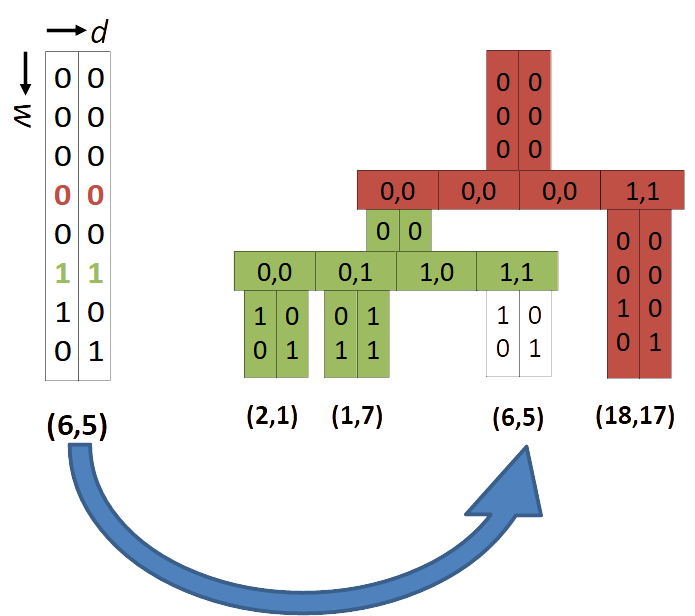

---
# Feel free to add content and custom Front Matter to this file.
# To modify the layout, see https://jekyllrb.com/docs/themes/#overriding-theme-defaults

layout: home


# layout: single
# classes: wide
# toc: true
# #toc_label: "My Table of Contents"
# toc_icon: "cog"
# toc_sticky: true

#author_profile: true
---


<!-- Kramdown TOC -->
* TOC
{:toc}

# The PH-tree

The [PH-tree](https://en.wikipedia.org/wiki/PH-tree) is a [spatial index](https://en.wikipedia.org/wiki/Spatial_database#Spatial_index) / multi-dimensional index. It is similar in function to other spatial indexes such as [quadtree](https://en.wikipedia.org/wiki/Quadtree), [kd-tree](https://en.wikipedia.org/wiki/K-d_tree) or [R-tree](https://en.wikipedia.org/wiki/R-tree).

It supports the usual operations such as insert/remove, lookup, window queries and nearest neighbor queries. It can store points or axis-aligned boxes.

The PH-tree's strengths are:

* Fast insert and remove operations. There is also no rebalancing, so insertion and removal execution times are quite predictable.
* Good scalability with dataset size. It is usually slower than other indexes when working on small datasets with 100 or 1000 entries, but it scales very well with large datasets and has been tested with 100M entries.
* Good scalability with dimension. It works best between 3 and 10-20 dimensions. The Java versions has been tested with 1000 dimensions where nearest neighbor queries were about as fast as with an R-tree and faster than a kd-tree.
* It deals well with most types of datasets, e.g. it works fine with strongly clustered data.
* Window queries are comparatively fast if they return a small result set, e.g. up to 10-50 entries. For larger result sets, other indexes are typically better.
* The PH-tree is an *ordered* tree, i.e. when traversing the data, e.g. the results of a query, the data is [Morton-ordered (z-order curve)](https://en.wikipedia.org/wiki/Z-order_curve).

Performance results can be found towards the end of this page.


# Implementations

My PH-tree implementations and source code:

* **C++**: [https://github.com/tzaeschke/phtree-cpp](https://github.com/tzaeschke/phtree-cpp) (my fork of Improbable's implementation)
* **Java**: [https://github.com/tzaeschke/phtree](https://github.com/tzaeschke/phtree)

Other PH-tree implementations that I am aware of:

* **C++** by [Improbable](https://github.com/improbable-eng/phtree-cpp)
* **C++** by [mcxme](https://github.com/mcxme/phtree)

Other spatial indexes (Java) can be found in the [TinSpin index library](https://github.com/tzaeschke/tinspin-indexes).

There is also the [TinSpin](http://tinspin.org) spatial index testing framework.


## Documents

* The PH-tree was developed at ETH Zurich and first published in
[The PH-Tree: A Space-Efficient Storage Structure and Multi-Dimensional Index](https://github.com/tzaeschke/phtree/blob/master/PH-Tree-v1.1-2014-06-28.pdf), Tilmann Zäschke, Christoph Zimmerli and Moira C. Norrie, Proceedings of Intl. Conf. on Management of Data (SIGMOD), 2014
* The current version of the PH-tree is discussed in more detail in this [The PH-Tree Revisited](https://github.com/tzaeschke/phtree/blob/master/PhTreeRevisited.pdf) (2015).
* There is a Master thesis about [Cluster-Computing and Parallelization for the Multi-Dimensional PH-Index](http://e-collection.library.ethz.ch/eserv/eth:47729/eth-47729-01.pdf) (2015).
* The hypercube navigation is discussed in detail in [Efficient Z-Ordered Traversal of Hypercube Indexes](https://github.com/tzaeschke/phtree/blob/master/Z-Ordered_Hypercube_Navigation.pdf) (2017).
* This webpage is based on [this presentation](https://github.com/tzaeschke/phtree-site/blob/main/originals/PH-tree-presentation-2018.pdf).


# How does it work?

The PH-tree is explained in several parts. First we discuss the structure of the tree, i.e. how the data is organized. Next we discuss navigation in the tree, i.e. how we can efficiently find data or find places to insert new data.


## PH-tree vs Quadtree

The PH-tree is similar to a quadtree in the sense that:

* It uses a hierarchy of nodes to organize data
* Each node is a square and has four quadrants (eight in 3D, in general 2dim quadrants), i.e. each node splits space in all dimensions.
* Nodes are split into sub-nodes when they contain too many points.

However, the PH-tree does some things differently in order to:

* improve scalability with higher dimensions than 2D or 3D,
* avoid “deep” trees when storing strongly clustered data,
* avoid nodes with $\lt 2$ entries (except for tree with $\lt 2$ entries), and
* reduce reshuffling of data when nodes are split/merged.

Differences in appearance to quadtrees

* The PH-tree works with integers (it works fine with floating point numbers as well, as we discuss later)
* The PH-tree’s “highest” possible node always has $(0,0)$ as center and an edge length $l_{max} = 2^{32}$ (for 32 bit coordinates).
* This node may not exist in most trees, but all nodes are aligned as if it existed, e.g. no other node overlaps with $(0,0)$.
* In a PH-tree, child nodes always have an edge length
$l_{child} = l_{parent} / 2^y$, with $y$ being a positive integer such that $l_{child}$ is always an $integer >= 1$, in fact $l_{child}$ is always a power of $2$.
* This limits the depth of a PH-tree to 32.
* Quadrant capacity = 1, i.e. a quadrant can hold at most one entry, either a sub-node entry or a point/data entry.


# Structure

## Overview and terminology

A PH-tree is essentially a [map](https://en.wikipedia.org/wiki/Associative_array), that maps **keys** to **values**, forming key/value pairs.
A **key** is a multi-dimensional vector of scalars, e.g. a representing a **coordinate** or **point**. For example, in 2D a key can represent $(x,y)$, in 3D it may be $(x, y, z)$.

Like many other [trees](https://en.wikipedia.org/wiki/Tree_(data_structure)), the PH-tree is a hierarchy of **nodes**.

Nodes use **quadrants** to arrange their data. Every quadrant contains exactly $0$ or $1$ **entries**. Every entry is either a key/value pair (**data entry**) or key/subnode pair with a pointer to a subnode (**subnode entry**). In a PH-tree, every node can have subnode entries, data entries, or a combination of both.

<!-- We will later see that (and why) a node has up to $2^{dimension}$ entries and how this scales. -->


## 1D PH-tree

Let's start with a very simple example, a 1-dimensional PH-tree that stores 1-dimensional points, AKA simple numbers.

The picture below shows an example of a 1-dimensional PH-tree with 8-bit coordinates (basically a tree of sorted integers). The coordinates are shown in
bit representation (base 2).
First we add (1) and (4) to an empty tree, resulting in a tree with a single node. Then we add (35), resulting in a tree with a root node and one child node.

Add (1) and (4)             |  Add (35)
:-------------------------:|:-------------------------:
{:width="90%"} | {:width="90%"}

Summary:

* The 1D PH-tree is equivalent to a [CritBit](https://cr.yp.to/critbit.html) [tree](https://en.wikipedia.org/wiki/Radix_tree) or [digital PATRICIA trie](https://de.wikipedia.org/wiki/Patricia-Trie).
* The tree uses the natural ordering of keys.
* The shape of the tree is independent of insertion order.
* Limited depth & imbalance: Maximum depth is the number of bits of a key, usually 32 or 64. Limited depth means limited imbalance.


## More terminology

<!-- A a stored **point** is also called **key** or  **coordinate**.
A PH-tree is essentially a [map](https://en.wikipedia.org/wiki/Associative_array), so every key is associated with a **value**, forming key/value pairs.

A node has (up to) $2^d$ **quadrants**, every quadrant contains $0$ or $1$ **entries**. Every entry is either a key/value pair or a key/subnode pair (subnode = child node). -->

The quadrants in a node are identified by their **hypercube address** (**HC address**).

From the viewpoint of a node, every point (=key) is divided into the following sections:

* **Infix**: all bits above the current node.
* **Prefix**: all bits between the current node and it’s parent.
* **Critical** bit(s): the bit(s) that represent the HC address of the point/key.
* **Postfix**: all bits below the current node (usually only if there is no child node, otherwise it's the infix of the subnode).

Infix, prefix, postfix, ... |
:-------------------------:|
{:width="60%"} |

Commonly used variables:

* ***d*** is the number of dimensions.
* ***w*** is the current depth of the tree, i.e. the length of the prefix. Usually we have $0 \leq w \lt 32$ or $0 \leq w \lt 64$.


## 2D PH-tree

The next example (left) demonstrates how keys with multiple dimensions are stored in the tree. Note how the two relevant bits from each key represent the position in the node's array of entries/quadrants. That means in order to find the correct quadrant in a node *we only need to extract two bits from a key* to locate the relevant quadrant/entry.

The example on the right shows a tree with two nodes. In order to insert (6,5) we only need to extract 2x2 bits and jump to the corresponding array slot.

A tree with two 2D-keys: (2,1) and (1.7)| A tree with two nodes
:-------------------------:|:-------------------------:
{:width="100%"}|{:width="100%"}

In the 1D example, the node's array was labeled "critical bit", in the 2D case it is labeled "hypercube". This means that the array forms a $d$-dimensional hypercube, see next section.


<!-- {:width="50%"} -->
<!-- {:width="50%"} -->

<!-- 
There are three possible scenarios when inserting an entry:
* a) Insertion where the infix/prefix of a node does not match: this results in insertion of a new node above the node with the infix. This is also called prefix collision or infix collision.
* b) Insertion in an existing node.
* c) INsertion with postfix collision. This result in insertion of a new node below the current node.

Infix, prefix, postfix, ... |
:-------------------------:|
{:width="50%"}
 -->


## Hypercube addressing

The nodes in a PH-tree all form $d$-dimensional binary [hypercubes](https://en.wikipedia.org/wiki/Hypercube) (binary Hamming Space). "Binary" here means that in each dimension there are only two possible values: $0$ and $1$.

This means, in order to address all quadrants in a node we need exactly **one bit for every dimension**.

Such an address is called Hypercube address or **HC address**. A HC address is simply a number with $d$ bits: e.g. 011…

The idea here is that this allows **processing of HC addresses with up to 64 dimensions in constant time** (assuming 64 bit CPU registers)**!**

<!-- {:width="50%"} -->

HC addresses for 1D, 2D and 3D|
:-------------------------:|
{:width="70%"} |

Note that the ordering of corners results in something called **[Morton-order](https://en.wikipedia.org/wiki/Z-order_curve)** and forms a **[Z-order curve](https://en.wikipedia.org/wiki/Z-order_curve)** when quadrants are traversed in the natural order of their HC addresses.


## Large nodes: AHC, LHC and BHC

With increasing dimensionality $d$, node quickly become unwieldy due to having up to $2^d$ quadrants. Therefore, PH-tree implementations usually use
arrays (array hypercube, or AHC) only for low dimensionality, e.g. up to 3 or 4 dimensions. For $4 \leq d \leq 8$ implementations may use a list (LHC representation).
For $d \gt 8$ many use trees, e.g. B+trees (BHC representation).

A 3D node in AHC (left) and LHC representation (right)|
:-------------------------:|
{:width="80%"}|

In the example above, the AHC implementations uses 1 bit per slot to signify occupancy of a slot/quadrant.


# Queries

## Point queries

A **point query** (**lookup**) checks whether a given key exists. How do we find a key?

For each node:

* compare infix/prefix
* extract HC-address from current key
* if entry at HC-address exists: access subnode or key/postfix

A simple 2D PH-tree|
:-------------------------:|
{:width="50%"}|


## Window queries

A **window queries** (**WQ**) find all points that lie inside a rectangular and axis-aligned query window defined by it's minimum and maximum: `qMin` and `qMax`.

***WARNING: the explanation of window queries is quite involved. For details and proofs please refer to the original publications, especially on "Efficient Z-Ordered Traversal of Hypercube Indexes" ([PDF](https://dl.gi.de/handle/20.500.12116/647) or [PDF](https://www.research-collection.ethz.ch/handle/20.500.11850/123617)).***

Window query on a point cloud|
:-------------------------:|
{:width="50%"}|

Example:
`qMin = (-1,6);`
`qMax = (9,6);`
`query(qMin, qMax);`

Query window overlapping with a tree node (top view)| The same tree node (side view) showing three entries.
:-------------------------:|:-------------------------:
{:width="70%"}|{:width="70%"}|

For each node, naive approach:
Iterate through all quadrants, compare each quadrants prefix with qMin/qMax.

Example: `qMin/qMax = (-1,6) / (9,6)`

Example query execution on one node:

```c++
(0,0) = (2,1)     -> mismatch
(0,1) = (1,7)     -> postfix mismatch
(1,0) = (1xx,0xx) -> mismatch
(1,1) = (6,5)     -> match!
```

Naive approach: for each node, iterate through all quadrants:

* calculate each quadrants corners
* compare each corners with qMin/qMax.

There are $2^d$ quadrants and we need to compare coordinates with every entry.
(Note: while $2^d$ sound "bad", it is basically the same with other spatial indexes, such as quadtrees or R-trees which all require comparison with all entries in a node, except that R-tree node sizes are usually limited differently)

$ \rightarrow O(d * 2^d)$ per node.

Can we do better?


### WQ traversal -- minPos & maxPos

For each node we calculate two values `minPos` and `maxPos` as follows:

```c++
for (d = 0; d <= dimensions; d++) {
    center = calcCenterOfNodeFromPrefix()
    minPos[d] = qMin[d] >= center ? 1 : 0;
    maxPos[d] = qMax[d] >= center ? 1 : 0;
}
```

(Note: `minPos[d]`/`maxPos[d]` refer to their `d`’s bit.)

Example:

```c++
query:      qMin(-1,6) / qMax (9,6) 
center:     (00000100,00000100)2 = (4,4)10 
minPos[0] = (-1 ≥ 4) = 0 
minPos[1] = (6 ≥ 4) = 1
maxPos[0] = (9 ≥ 4) = 1 
maxPos[1] = (6 ≥ 4) = 1 
```

We get: `-> minPos / maxPos: (0,1)/(1,1)`

How are these valuers useful?

### WQ traversal -- Idea #1: min/max

`minPos` and `maxPos` are the **lowest** and **highest** overlapping quadrant!

In our example this removes only the first quadrant from iteration, but it may remove more.
Also, it is cheap, calculated in $O(d)$  per node!
However, we still have $O(d + d * 2^d)$ per node

### WQ traversal -- Idea #2: check quadrant

We can use `minPos` and `maxPos` to quickly check whether a quadrant at position `pos` overlaps with the query box:

```hasOverlap = ((pos | minPos) & maxPos) == pos);```

Example:

```c++
minPos/maxPos = (01)/(11)

pos (0,1):   (01 | 01) & 11 = 01         -> overlap
pos (1,0):   (10 | 01) & 11 = 11 != 10   -> no overlap 
pos (1,1):   (11 | 01) & 11 = 11         -> overlap   
```

Intuition:

* `minPos` has `1` if positions with `‘0’` should be skipped
* `maxPos` has `0` if positions with `‘1’` should be skipped

This reduces complexity from $O(d + d*2^d)$ to $O(d + 2^d)$.

Now the large nodes start looking like an advantage. We can check whether a quadrant overlaps with a query box in $O(1)$ per quadrant for up to 64 dimensions!


### WQ traversal -- Idea #3: find next overlapping quadrant

*Warning: Idea #3 is not required to implement an efficient PH-tree. The proposed idea works but usually provides next to no advantage, see [Caveats](#wq-traversal----idea-3----caveat).*

Find a function `pos_next = inc(pos, minPos, maxPos)` that returns the next matching quadrant.
This allows skipping quadrant for which `hasOverlap(...)` fails. The trick is that this method operates in $O(1)$, so it does not have to perform the check for
any quadrant.

```c++
long inc(pos, minPos, maxPos) {
  long r = pos | (~maxPos);
  return ((++r) & maxPos) | minPos;
}
```

Intuition:

* We want to increment by $1$
* We want to 'skip' all quadrants that do not overlap with the query, i.e. we want to skip all quadrants where `minPos[d]==1` or `maxPos[d]==0` (= constrained bits).
* To achieve this, we set all constrained bits to `1`. If we add `1`, these bits will overflow to the next bit, i.e. the +1 increment will instead increment the next bit.
* After the increment we set all constrained bits back to their 'valid' value.

Example: `inc(01) => (11)`

* in pos, set all bits to ‘1’ where only one value is allowed (constrained bits).

```c++
pos = pos | minPos | (~maxPos) = 01 | 01 | 00 = 01;
```

* now, if we add ‘1’ for increment, any change to a constrained bit will cause an overflow and update the next higher bit.

```c++
pos++ => 01 + 1 = 10;
```

* then we set all the constrained bits back to their previous value.

```c++
pos = (pos & maxPos) | minPos = (10 & 11) | 01 = 11;
```

--> `inc()` finds next slot in $O(1)$ for $d < 64$

Complexity:
If `inc()` executes in $O(1)$, then complexity for traversing a node is still $O(d + 2^d)$, however it is also optimal in the sense that the complexity is at the same time
$O(d + number\\_of\\_matching\\_entries)$.

This is better than quadtrees, octrees or R-trees which all have $O(d * number\\_of\\_ALL\\_entries)$ per node.


### WQ traversal -- Idea #3 -- Caveat

In practice, `inc()` is rarely useful.
For a normal window query, most modes usually overlap with query windows such that a very significant portion of their quadrants overlap with the query. At the same time, with higher dimensionality, most nodes use LHC or BHC representation, so there are no empty quadrant. This means iterating over all quadrants is not expensive and combined with the cheap `checkOverlap()` this is actually very efficient.

The problem with `pos = inc()` is that we need to look up the next entry with a kind of 'search(pos)' in a node that uses LHC or BHC, resulting in $O(\log{n})$. This is more expensive than finding the next entry with an iterator and calling `checkOverlap()` on it, even if we have to do that several times.

Also, `checkOverlap()` and `inc()` are both cheap compared to the node from RAM into the CPU, so at least for small $d$, the difference does not really matter.


**However**, `inc()` should not be dismissed:

* It should be possible to implement a list (LHC) or B+tree (BHC) that uses a specialized lookup method `iter = find(pos, prev_iter)` that uses a previously returned as hint to find the next iterator in less than $O(\log{n})$.
* It may be useful for very 'narrow' query windows that typically overlap with only very few quadrants.


### WQ traversal -- Summary

For each node calculate `minPos`/`maxPos`: $O(d)$

Use these values:

* find start/end point for iteration
* to `checkOverlap()` whether any quadrant matches: $O(1)$
* get next valid quadrant with `inc()`: $O(1)$


### WQ result ordering

When traversing the tree as described above (depth-first & traverse nodes in order of their HC-address) the result follows a [Z-oder curve (also called Morton order)](https://en.wikipedia.org/wiki/Z-order_curve):

PH-tree traversal creates a Z-order curve|
:-------------------------:|:-------------------------:
{:width="100%"}|


# Floating point keys

The PH-tree can natively only store integer coordinates. There are two main approaches to storing floating point coordinates in the PH-tree.


## IEEE conversion

The IEEE conversion allows **fast** and **lossless conversion** from floating-point to integer and back. The name stems from the fact that the bit representation of floating point numbers, as defined by the [IEEE 754](https://en.wikipedia.org/wiki/IEEE_754) is suitable to be used as integer. The central advantages of the format is that it preserves the ordering of values (at least for positive values).

Java:

```java
long encode(double value) {
    long r = Double.doubleToRawLongBits(value);
    return (r >= 0) ? r : r ^ 0x7FFFFFFFFFFFFFFFL;
}
```

C++:

```c++
std::int64_t encode(double value) {
    std::int64_t r;
    memcpy(&r, &value, sizeof(r));
    return r >= 0 ? r : r ^ 0x7FFFFFFFFFFFFFFFL;
}
```

Essentially, this takes the bit-representation of a floating point value and treats it as integer (after some conversion for negative numbers). This preserves the total ordering of values which is all that is required for `insert()`, `remove()`, `point_query()` and `window_query()`.
Other operations, such as `nearest_neighbor_query()`, need to convert coordinates back to floating point data.


## Integer multiply conversion

Another common conversion is strategy is to multiply the floating point value with a constant and casting it to an integer:

```c++
long encode(double value) {
    return (long) value * 100;
}
```

This is also **fast** an preserves **a certain amount of precision**.

The main advantage resulting index tends to be faster. This effect hasn’t been fully investigated, but there are two effects:

* The tree is more “dense”, i.e. the length of the infix is more often zero. That allows skipping comparison of infixes when navigating the tree
* If the implementation supports prefix-sharing (bit-streaming): Normal integer values tend to have longer common prefixes, allowing for more prefix sharing, resulting in lower memory usage and better cache usage.

One (slight?) problem is that the rounding affects the precision of all operations: `insert()`, `remove()`, `point_query()`, `window_query()`, `nearest_neighbor_query()`, … .


# Prefix sharing (bit streams)

All entries in a node share a common prefix.
E.g. in the example tree, all entries in the red node share a common prefix $(00000,00000)_2$.

Example PH-tree|
:-------------------------:|:-------------------------:
{:width="40%"}|

To save memory, we can store the prefix (actually infix) only once per node.

Let's look at the red node in the example above (excluding bits for array of entries):

* normal storage: `2 keys = 2 * 2 dimensions * 8 bit = 32 bit`
* prefix sharing: `1 prefix + 2 keys = (1 * 2 dim * 1 bit) + (2 * 2 dim * 2 bit) = 2 + 8 bit = 10 bit`

The bits above the infix can be taken from the parent node. The bits above the postfix are equal to the array position.

Prefix sharing is not a necessary part of PH-tree, but it can be a useful performance optimization.
This approach can safe a lot of memory, especially when used with multiply-conversion. With the Java implementation this gave performance improvements of 20%-30% for most operations.
The C++ implementation does not currently implement this.


# Rectangles & boxes as key

The plain PH-tree can only store points (vectors) as keys. However, storing axis-aligned boxes as keys can efficiently be done by putting the two defining corners (minimum and maximum) of a box into a single $2*d$ key, for example by concatenating them:

$ k = \\{ min_0, min_1, …, min_{d−1}, max_0, max_1, …, max_{d−1} \\}$

Example: a 2D box is stored in a 4D point:   (2,3)/(4,5) → (2,3,4,5).

This works trivially for lookup, insert and remove operations. Window queries need to be converted from d d-dimensional vectors to (2∗d)-dimensional vectors. For a window query that matches all boxes that are completely inside the query box, the query keys are:

$kmin = \\{ min_0, min_1, …, min_{d-1}, min_0, min_1, …, min_{d−1} \\}$
$kmax = \\{ max_0, max_1, …, max_{d-1}, max_0, max_1, …, max_{d−1} \\} $

Or, for a window query that matches all boxes that intersect with a query box:

$kmin = \\{ −\infty,    −\infty, ...,    −\infty, min_0, min_1, …, min_{d−1} \\} $
$kmax = \\{ max_0, max_1, ..., max_{d−1},   +\infty,  +\infty, …,    +\infty \\}$

Example:
<!-- $qMin/qMax = (3,4)/(4,5) → (−\infty, −\infty, 3, 4)/(4, 5, +\infty, +\infty)$ -->

$qMin = (3,4) → (−\infty, −\infty, 3, 4)$

$qMax = (4,5) → (4, 5, +\infty, +\infty)$

This is usually managed internally by the implementation. For more details please see ["The PH-tree revisited"](https://github.com/tzaeschke/phtree/blob/master/PhTreeRevisited.pdf).  


# Performance (Java only)

<!-- Detailed performance measurements (java implementation) are available [here](https://github.com/tzaeschke/TinSpin/blob/master/doc/benchmark-2017-01/Diagrams.pdf). -->

This section shows the result for a synthetic dataset with strongly clustered data. The dataset forms a cube between $(0...1)$ in any dimension with uniformly random distributed clusters. Each cluster consists of 100s or 1000s or more points (floating point coordinates).

2D CLUSTER dataset (each blob is a cluster)|
:-------------------------:|:-------------------------:
{:width="30%"}|

We compare multiple indexes: a kd-tree (KD), a quadtree (QT0Z), a R\*tree (R\*Tree), and two PH-trees, one with default [IEEE conversion](#ieee-conversion) (PH2) and one with [Integer-Multiply conversion](#integer-multiply-conversion) (PH2-IPP). All are written in Java and available [here](https://github.com/tzaeschke/tinspin-indexes).

Details and more experiments are available [here](https://github.com/tzaeschke/TinSpin/blob/master/doc/benchmark-2017-01/Diagrams.pdf).


## 3D points - varying dataset size

Results for `insert()` and `update()` on indexes with varying size.

* x-axis: index size, ranging from 500'000 to 50'000'000 entries.
* y-axis: operations per second (for 'memory': bytes per entry)


### Point insertion

Here the kd-tree is the fastest and R*tree the slowest. However, the kd-tree degrades considerably with index size. The PH-trees are almost oblivious to index size.

Note that this was measured by filling up an empty index until it contained the declared number of points.

`insert()`|
:-------------------------:|
{:width="80%"}|


### Point update (move to new position)

This is essentially a combined `remove()` + `insert()`. Here the PH-trees are the fastest.

`update()`|
:-------------------------:|
{:width="80%"}|


### 10 nearest neighbor queries

Find 10 nearest neighbors. The R*tree is the fastest for smaller trees, the PH-trees (especially the Integer-Multiply variant) is fastest for larger trees.

`10 NN`|
:-------------------------:|
{:width="80%"}|


### Window queries

Find all points in a rectangular query window. Query windows are sized such that on average 1000 point are found. R*Trees and quadtrees deliver the best performance in this scenario.

`window_query()` returning ~1000 results|
:-------------------------:|
{:width="80%"}|


The following tests use indexes with 1'000'000 entries and measure how the query window size affects performance. Query windows are size such that they return on average 1, 10, 100 or 1000 points. We show the same data twice, once with logarithm y-axes (top) and once with linear y-axis (bottom).

`window_query()` returning ~1000 results|
:-------------------------:|
{:width="80%"}|
:-------------------------:|
{:width="80%"}|


### Memory consumption

The PH-tree consume the least amount of memory (closely followed by the quadtree).

memory consumption [bytes per entry] |
:-------------------------:|
{:width="80%"}|


## 1'000'000 points - varying dimensionality

The following tests use datasets with 1'000'000 entries and measure the effect of dimensionality.

* x-axis: # of dimensions, ranging from $d=2$ to $d=30$.
* y-axis: operations per second.


### Point insertion

The kd-tree is the fastest and R*tree the slowest. Unlike most other indexes, the PH-trees are almost independent of index size.

`insert()`|
:-------------------------:|
{:width="80%"}|


### Point update (move to new position)

As before, this is essentially a combined `remove()` + `insert()`. Again, the PH-trees are the fastest, but degrading somewhat with index size.

`update()`|
:-------------------------:|
{:width="80%"}|


### 10 nearest neighbor queries

Find 10 nearest neighbors. The R*tree and PH-trees are the fastest, with the Multiply-Conversion PH-tree gaining an edge with increasing dimensionality (diagram uses logarithmic scale!).

`10 NN` (logarithmic scale!)|
:-------------------------:|
{:width="80%"}|


### Window queries

Find all points in a rectangular query window. Query windows are sized such that on average 1000 point are found (diagram uses logarithmic scale!).

Again for large query windows (1000 results) in low dimensionality, PH-trees are not the best, but scale well and come out top for $d \ge 10$.

`window_query()` returning ~1000 results  (logarithmic scale!)|
:-------------------------:|
{:width="80%"}|


# Conclusion

Advantages:

* Fast `insert()` and especially `update()` operations
* Scales well with large datasets
* Scales well with increasing dimensionality
* Performs well with strongly clustered data

General features:

* points or rectangle keys
* integer and floating point data
* insert/update/remove, point query, window query, kNN search

Unusual features:

* Z-ordered
* no rebalancing: may benefit concurrency or persistence
* Hypercube navigation exploits 64 bit constant time operations

Disadvantages:

* Quite complex to implement because of ubiquitous bit manipulation.
* PH-trees are "maps" (other indexes are multi-maps), so they need a kind of collection (list/set/map) as primary value associated with every key
* Native format is 'integer'. Fortunately there are fast and lossless conversions available.

For questions/suggestions please contact me:

* [PH-tree Discord server](https://discord.gg/YmJTWYHPCA)
* email:  `zoodb (AT) gmx.de`
* GitHub Issues: [C++](https://github.com/tzaeschke/phtree-cpp), [Java](https://github.com/tzaeschke/phtree)
